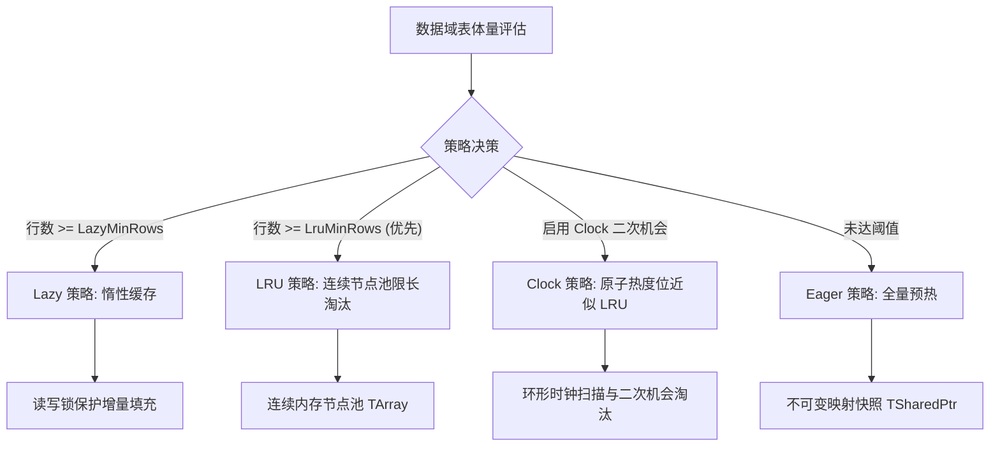

# GameCore 缓存与内存管理架构

本架构文档阐述 `GameCore` 底座提供的核心缓存与高性能内存管理设施：
1. **四策略版本化缓存（`FVersionedCache`）**：Eager全量快照 / Lazy惰性 / LRU连续节点池 / Clock二次机会算法自适应、代次守卫与指针稳定化；
2. **底层高性能内存与容器原语**：`TLinearArena` 线性内存池、`FScopedFrameScratchpad` 帧局部暂存器、`TFixedBlockAllocator` 定长小块无碎片池、`TScratchArray` 栈保底动态数组、`TSlotMap` 紧凑实体槽位表与 `TRewindSnapshotBuffer` 确定性回放缓冲区。

> **组件解耦与迁移提示**：
> 面向 Actor 与 Component 级的**通用业务对象池（`UObjectPoolSubsystem`）**已拆分至独立插件 **`Plugins/GamePool`**（提供 `IGamePoolable` 接口与 GC 防卡顿治理），`GameCore` 专注于纯 C++ 底层高性能内存原语。

---

## 1. 四策略版本化缓存 (`FVersionedCache`)

在游戏运行时（尤其是配置数据、计算管线、复合数据查询中），不同数据规模对缓存的需求差异极大：
- **微小数据量（< 100 行）**：全量预热（Eager）开销极小且单次查询即最快；
- **超大规模数据量（> 10000 行）**：全量预热占用高内存且冷启动拖慢，适合惰性构建（Lazy）、LRU 限长淘汰或 Clock 二次机会淘汰；
- **高并发读**：多线程查询时不能因缓存重建或扩容搬移而导致读取方拿到悬垂指针。

### 1.1 策略定义与自适应切换

```mermaid
graph TD
    Data[数据域表体量评估] --> Auto{策略决策}
    Auto -- "行数 >= LazyMinRows" --> Lazy[Lazy 策略: 惰性缓存]
    Auto -- "行数 >= LruMinRows (优先)" --> LRU[LRU 策略: 连续节点池限长淘汰]
    Auto -- "启用 Clock 二次机会" --> Clock[Clock 策略: 原子热度位近似 LRU]
    Auto -- "未达阈值" --> Eager[Eager 策略: 全量预热]

    Eager --> Snapshot[不可变映射快照 TSharedPtr<const TMap>]
    Lazy --> MutexMap[读写锁保护增量填充]
    LRU --> PoolArray[连续内存节点池 TArray<FLruIndexPool::FLruNode>]
    Clock --> ClockRing[环形时钟扫描与二次机会淘汰]
```

- **Eager 策略**：
  整个缓存容器被包装在一个 `TSharedPtr<const TMap<KeyType, ValueType>>` 不可变快照中。重构时在锁外构建全新 Map，完成后只需原子替换共享指针。读取路径仅持极短只读读锁，并发性能无限逼近原生只读指针（基准压测约 **10.5 ns/op**）。
- **Lazy 策略**：
  未查询过的 Key 在首次命中时动态构建，后续查询直接命中缓存。
- **LRU 策略**：
  采用预分配的连续节点池（`TArray<FLruIndexPool::FLruNode>`），利用 `int32` 索引构成双向链表。当缓存容量到达上限时，直接 O(1) 淘汰最久未访问节点，无零散小对象内存分配，彻底消灭内存碎片。
- **Clock 策略（二次机会算法）**：
  使用原子热度标志位（`std::atomic<bool> bReferenced`）与环形遍历指针（`HandIndex`），在命中时仅执行原子无锁写操作，淘汰扫描时进行两次判断，具备与 LRU 相仿的命中率但消除了每次访问移动链表节点的写锁竞争。

### 1.2 指针稳定化、单键失效与代次守卫
所有从缓存中取出的复合数据，均以 `TSharedPtr<const ValueType>` 形式交付给调用方。即便在缓存执行 `Rebuild()`、执行淘汰或调用 `Invalidate(Key)` 精确单条剔除时：
- 被驱逐或失效的对象只是从缓存字典中移除；
- 外部正在使用该对象的线程持有着 `TSharedPtr`，对象的强引用计数仍大于零，对象不会被提前析构；
- 外部使用完毕后对象正常析构，彻底消灭野指针与生命周期竞态。
- **代次守卫（Generation Guard）**：每次 `Rebuild()` 自增代次；Lazy / LRU / Clock 在锁外完成计算后，若发现当前代次已落后（期间发生了全量重建），主动丢弃旧代计算结果，杜绝旧数据覆盖新快照。

---

## 2. 底层高性能内存与容器原语

### 2.1 `TLinearArena`（高速单向线性分配器）
头文件：`#include "Memory/TLinearArena.h"`
- **连续块分段递增**：预分配固定 Chunk，内部单向指针自增分配（Bump Allocation），每次分配耗时在 **1~3 纳秒**。
- **批量一次性重置**：不执行单个对象的单独释放，在帧或逻辑阶段结束时调用 `Reset()` 一次性回滚偏移指针，内存分配开销降至绝对零。

### 2.2 `FScopedFrameScratchpad`（帧局部双缓冲暂存栈）
头文件：`#include "Memory/FScopedFrameScratchpad.h"`
- 针对每帧算法计算（如批量距离排序、临时射线命中收集、物理接触点暂存）；
- 基于双缓冲 Arena 实现，支持通过 RAII 作用域自动申请与回滚游标（Marker）；跨帧自动轮转清理，杜绝临时数据泄漏至常驻内存。

### 2.3 `TFixedBlockAllocator`（定长小块侵入式空闲链表分配器）
头文件：`#include "Memory/TFixedBlockAllocator.h"`
- **侵入式链表（Intrusive Free List）**：内存块未被占用时就地复用自身空间作为链表节点指针，零额外元数据开销。
- **严格 O(1) 申请与释放**：单向链表头插头取，每次申请与归还仅需 2 条指令。

### 2.4 `TScratchArray<T, InlineCapacity>`（栈保底动态数组）
头文件：`#include "Memory/TScratchArray.h"`
- 类似 SmallVector 机制：预设固定容量 `InlineCapacity` 位于栈内存上；
- 元素数量在阈值内完全免除堆分配，超过阈值时透明回退至堆内存，在小数据量算法路径上性能极高。

### 2.5 `TSlotMap<T, TTag>`（紧凑存储与安全代际句柄映射）
头文件：`#include "Containers/TSlotMap.h"`
- **密集数组（Dense Array）+ 稀疏槽位（Sparse Slots）**：数据在连续内存中紧凑存储，遍历时具备极高的 CPU 缓存命中率。
- **代际号防 ABA**：外部持有 `TGameHandle<TTag>`（32位索引 + 32位代际号）。当槽位复用后代际号自增，旧句柄访问瞬间安全判定失效，彻底消灭野指针与悬垂引用。

### 2.6 `TRewindSnapshotBuffer<TSnapshot>`（确定性回溯快照环形缓冲区）
头文件：`#include "Determinism/TRewindSnapshotBuffer.h"`
- 面向确定性锁步、回滚网络同步与逻辑重放设计；
- 定长环形缓冲数组存储历史帧快照，提供帧号精准寻址、上界/下界快照差值查找与环形历史覆盖。
